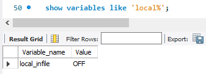
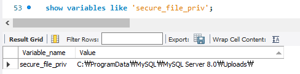
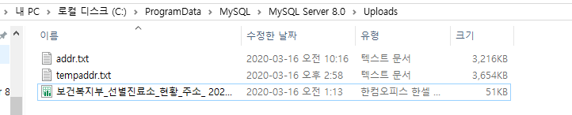
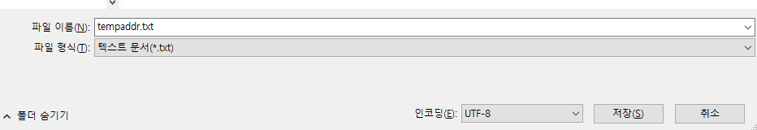

## 테이블에 한글값 제대로 입력되게 하기
* set charset utf8;
* alter database 데이터베이스명 default character set utf8;
* alter table 테이블명 convert to character set utf8;

## 날짜 계산법
* 하루 더하기: date_add('2020-02-29', interval 1 day)
* 하루 빼기: date_add('2020-02-29', interval -1 day)
* 일 => day, 년 => year, 월 => month, 시간 => hour, 분 => minute, 초 => second

## 문자를 날짜로 변환시키기
* date_format('2020-02-09', '%Y-%m-%d') => 날짜 형태의 '2020-02-29'로 출력

## 파일에 있는 데이터를 데이터베이스에 저장시키기
* local_infile 설정값이 ON인지 확인하기
    
* 'set global local_infile = 1'을 통해 설정값 ON으로 만들기 (= 0 을 하면 설정값 OFF로 바뀜)
* 'show variables like "secure_file_priv"'을 통해 secure_file 위치 찾기 (만약 ProgramData파일이 C드라이브에서 보이지 않는다면 URL에 직접 입력하면 폴더에 들어갈 수 있음)
    
* 아래와 같이 infile할 파일들을 해당 폴더로 옮기기
    
* 아래와 같은 SQL구문으로 data infile 하기 (기존에 table은 컬럼의 갯수에 맞게 만들어 놓아야 함, 아닌 방법도 존재하기는 함)
    ```
    load data infile 'C:\\ProgramData\\MySQL\\MySQL Server 8.0\\Uploads\\tempaddr.txt'
    into table tempaddr
    fields terminated by '|'
    optionally enclosed by '"'
    lines terminated by '\n'
    ignore 1 lines;
    ```
* 만약 'invalid uft8 character string'와 같은 에러가 발생한다면 해당 파일을 utf8로 변경하여 다시 만들기
* txt파일 경우 다른 이름으로 저장을 누르게 되면 저장버튼 옆에 인코딩 설정이 가능
    
* 만약 'Row 31193 doesn't contain data for all columns'와 같은 에러가 발생한다면 txt파일 같은 경우는 맨 마지막에 엔터키를 눌러 마지막 칸을 공백으로 만들어 뒀을 때 제대로 동작 가능
* 참고 url: https://forums.mysql.com/read.php?152,674208,674208 