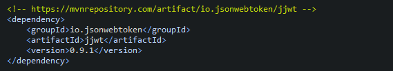
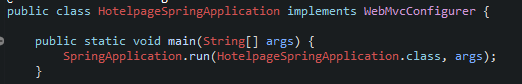
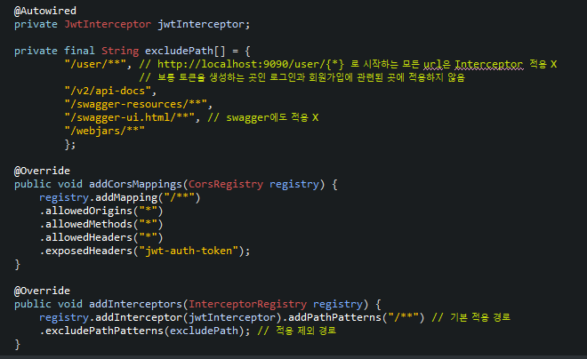
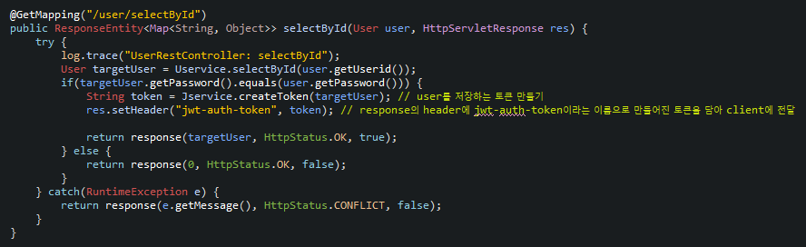
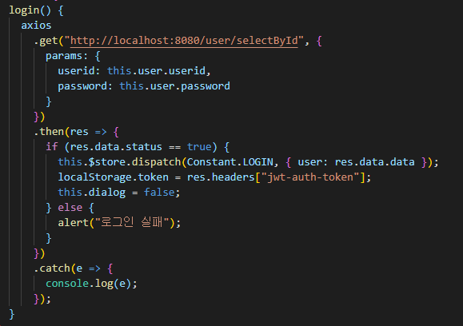
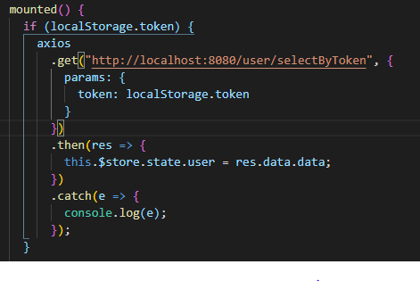
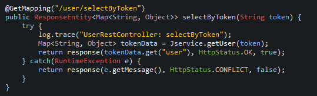
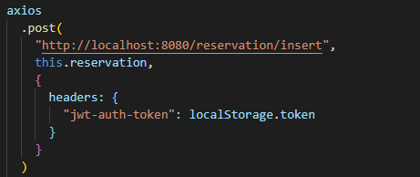

## 기본설정
* STS에서 Starter Project 생성 (STS 상단바의 Window -> Preference에서 encoding을 입력 후 Workspace, CSS, HTML, JSP, XML 모두 UTF-8로 지정)
   * Name(=> ex) hotelpage-spring), Group(=> ex) com), Artifact(=> ex) hotelpage), Description(=> ex) hotelpage using spring) 원하는 데로 입력
   * 하단의 Next클릭 후 JDBC API, Spring Boot Devtools, Spring Web, MySQL Driver(MySQL 사용 시), MyBatis FrameWork(MyBatis 사용 시), Lombok(Lombok 사용 시) select후 finish
   * STS 3.9.7버전을 사용할 경우 프로젝트에 빨간불이 들어와 있는데 pom.xml에 properties안에 <maven-jar-plugin.version>3.1.1</maven-jar-plugin.version>를 기입 후 프로젝트 오른쪽 클릭 후 maven -> update project 클릭

## Swagger 사용방법
* https://mvnrepository.com 에 접속
* 검색창에 springfox 검색
* Springfox Swagger2를 클릭하여 최신버전 클릭 후 dependency를 pom.xml에 복사 붙여넣기
* Springfox Swagger UI를 클릭하여 최신버전 클릭 후 dependency를 pom.xml에 복사 붙여넣기
* 프로젝트 오른쪽 클릭 후 maven -> update project 클릭
* src/main/java/{Group}.{Artifact}에 있는 SpringApplication에 다음과 같이 기입
   

 ## Properties 설정 (MySQL 등록)
 * 다음 사진과 같이 기입 (주석은 jsp를 사용할 경우, mybatis.config는 MyBatis를 사용할 경우)
   

## JWT 적용시키기
* https://mvnrepository.com 에 접속
* 검색창에 jjwt 검색
* JSON Web Token Support For The JVM을 클릭하여 최신버전 클릭 후 dependency를 pom.xml에 복사 붙여넣기
   
* JwtService 만들기
   ```
   import java.util.Date;
   import java.util.Map;

   import org.springframework.stereotype.Component;

   import com.hotelpage.dto.User;

   import io.jsonwebtoken.Claims;
   import io.jsonwebtoken.Jws;
   import io.jsonwebtoken.Jwts;
   import io.jsonwebtoken.SignatureAlgorithm;

   @Component
   public class JwtService {
      private String secretKey = "hotelpage";
      private Long expireTime = 1000L * 60 * 5;
      
      // 토큰 생성
      public String createToken(User user) {
         return Jwts.builder()
               .setHeaderParam("typ",  "JWT") // 토큰의 타입
               .setSubject("userToken") // 토큰의 제목
               .setExpiration(new Date(System.currentTimeMillis() + expireTime)) // 토큰의 유효기간
               .claim("user", user) // 토큰에 담고 싶은 정보
               .signWith(SignatureAlgorithm.HS256, secretKey.getBytes()) // secretKey를 사용하여 암호화 알고리즘 적용
               .compact(); // 직렬화 처리 (String으로 변경)
      }
      
      // 토큰을 사용하여 유저정보 얻기
      public Map<String, Object> getUser(String token) {
         Jws<Claims> claims = null;
         try {
            claims = Jwts.parser().setSigningKey(secretKey.getBytes()).parseClaimsJws(token);
         } catch(Exception e) {
            throw new RuntimeException();
         }
         
         return claims.getBody();
      }
      
      // 토큰의 유효성 검증
      // 문제가 존재하면 예외 발생, 그렇지 않은 경우는 문제 없다고 판단
      public void checkValid(String token) {
         Jwts.parser().setSigningKey(secretKey.getBytes()).parseClaimsJws(token);
      }
   }
   ```
* JwtInterceptor 만들기
   ```
   import javax.servlet.http.HttpServletRequest;
   import javax.servlet.http.HttpServletResponse;

   import org.springframework.beans.factory.annotation.Autowired;
   import org.springframework.stereotype.Component;
   import org.springframework.web.servlet.HandlerInterceptor;

   @Component
   public class JwtInterceptor implements HandlerInterceptor {
      
      @Autowired
      private JwtService jwtService;
      
      @Override
      public boolean preHandle(HttpServletRequest request, HttpServletResponse response, Object handler)
            throws Exception {
         // option 요청은 바로 통과
         if(request.getMethod().equals("OPTIONS")) {
            return true;
         } else {
            String token = request.getHeader("jwt-auth-token"); // request의 header에 jwt-auth-token이라는 key값에 알맞는 value값을 token으로 저장
            if(token != null && token.length() > 0) {
               jwtService.checkValid(token); // 토큰의 유효성 검증
               return true;
            } else { // 해당 토큰의 유효성이 알맞지 않은 경우
               throw new RuntimeException("인증 토큰이 존재하지 않습니다.");
            }
         }
      }
   }
   ```
* src/main/java/{Group}.{Artifact}에 있는 SpringApplication에 다음과 같이 WebMvcConfigurer를 implements 하기
   
* 아래에 다음과 같이 Autowired와 Override 하기
   
* 만약 addCorsMappings와 addInterceptors의 위치가 바뀔 시 에러가 발생할 수 있음
* Controller에서 만들어 놓은 JwtService를 Autowired 한 뒤 로그인에 해당하는 부분에 client의 localStorage에 토큰을 저장할 수 있게 다음과 같이 response로 토큰을 보내기
   
* client에서 axios를 통해 받은 결과값의 header에서 다음과 같이 토큰 확인한 후 localStorage에 저장하기
   
* Vue같은 경우 App.vue에서 다음과 같이 토큰이 존재할 시 해당 토큰으로 user정보를 불러옴으로 써 로그인 상태를 유지
   
* Controller에 만들어 놓은 selectByToken에 해당하는 함수
   
* 제외시켜놓은 /user/**에 해당하는 것 빼고는 axios를 요청할 때 다음과 같이 header에 localStorage에 저장해 놓은 토큰 값을 같이 보내기
   