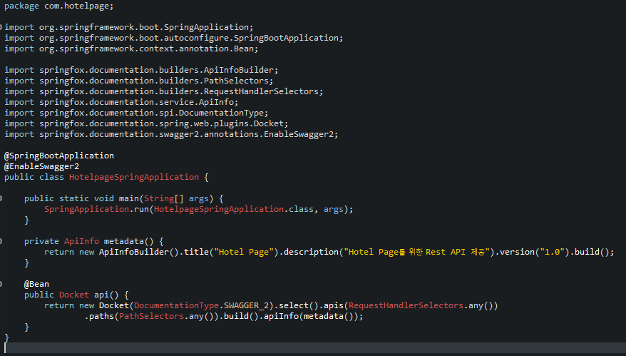
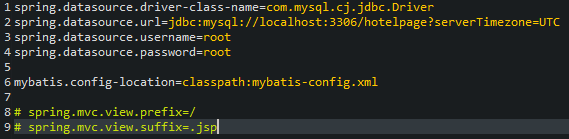

## 기본설정
 * STS에서 Starter Project 생성 (STS 상단바의 Window -> Preference에서 encoding을 입력 후 Workspace, CSS, HTML, JSP, XML 모두 UTF-8로 지정)
    * Name(=> ex) hotelpage-spring), Group(=> ex) com), Artifact(=> ex) hotelpage), Description(=> ex) hotelpage using spring) 원하는 데로 입력
    * 하단의 Next클릭 후 JDBC API, Spring Boot Devtools, Spring Web, MySQL Driver(MySQL 사용 시), MyBatis FrameWork(MyBatis 사용 시), Lombok(Lombok 사용 시) select후 finish
    * STS 3.9.7버전을 사용할 경우 프로젝트에 빨간불이 들어와 있는데 pom.xml에 properties안에 <maven-jar-plugin.version>3.1.1</maven-jar-plugin.version>를 기입 후 프로젝트 오른쪽 클릭 후 maven -> update project 클릭

## Swagger 사용방법
 * https://mvnrepository.com 에 접속
 * 검색창에 springfox 검색
 * Springfox Swagger2를 클릭하여 최신버전 클릭 후 dependency를 pom.xml에 복사 붙여넣기
 * Springfox Swagger UI를 클릭하여 최신버전 클릭 후 dependency를 pom.xml에 복사 붙여넣기
 * 프로젝트 오른쪽 클릭 후 maven -> update project 클릭
 * src/main/java/{Group}.{Artifact}에 있는 SpringApplication에 다음과 같이 기입
    

 ## Properties 설정 (MySQL 등록)
  * 다음 사진과 같이 기입 (주석은 jsp를 사용할 경우, mybatis.config는 MyBatis를 사용할 경우)
    