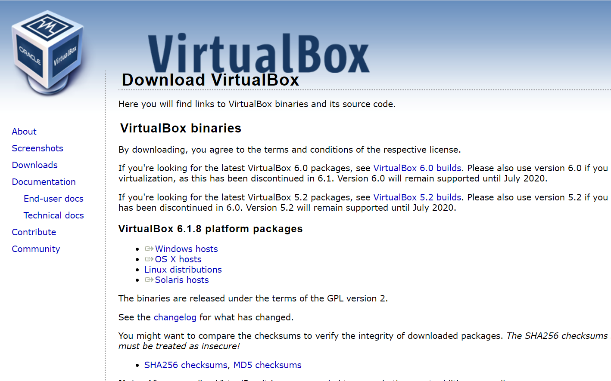
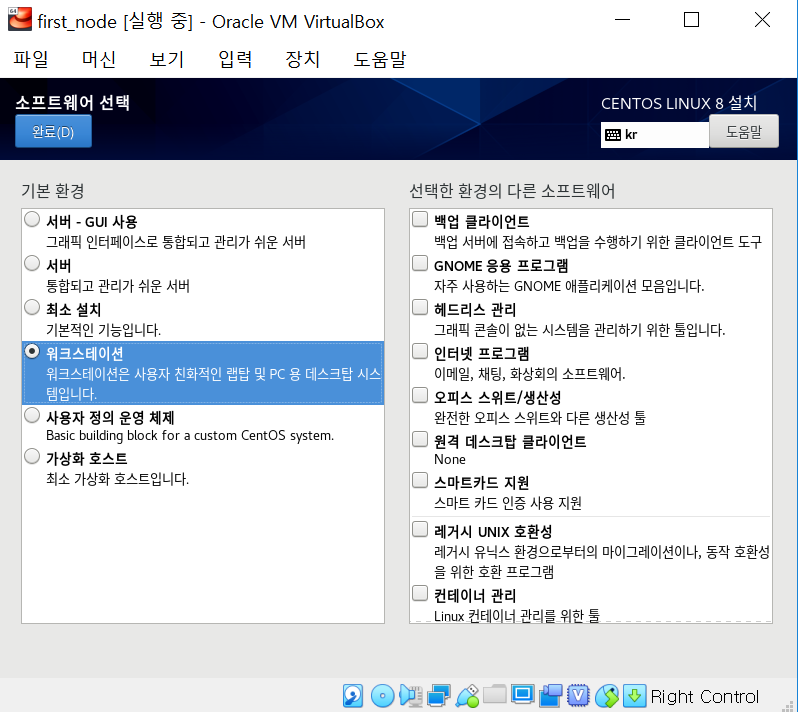
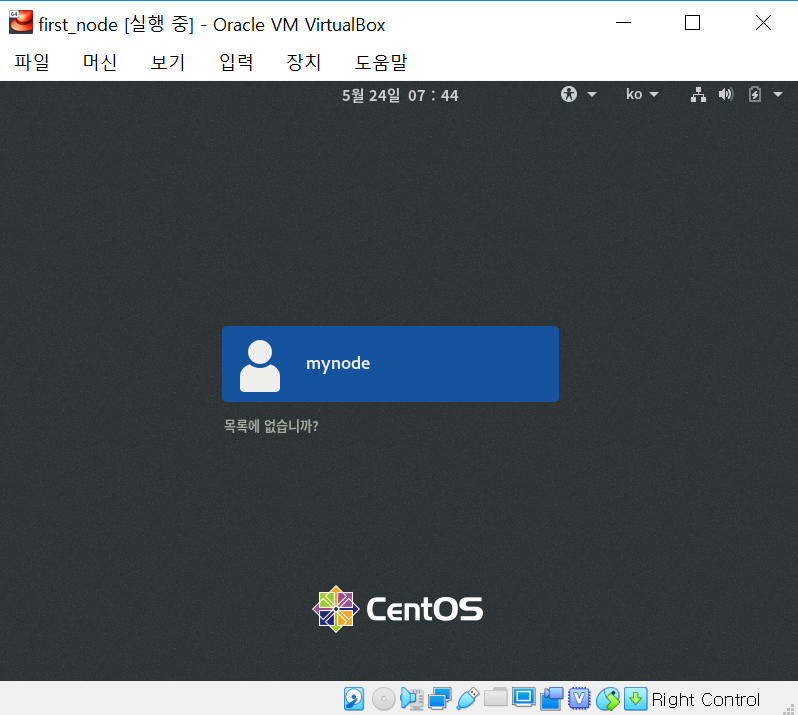

# CentOS 설치
* CentOS 다운로드 사이트 접속 : https://www.centos.org/download
* CentOS Linux DVD ISO 클릭
    
* 위에 3개 중 아무거나 클릭하여 설치
    

# Virtual Box 설치
* Virtual Box 다운로드 사이트 접속 : https://virtualbox.org/wiki/Downloads
* Window hosts 클릭하여 설치
    

# Virtual Box에 CentOS 설치 (총 3개의 OS 생성)
## 가상머신 만들기
* Virtual Box 실행시키기
    
* 이름, 머신폴더, 종류, 버전 선택 </br>
    
* 메모리 크기 선택 (Cloudera를 설치 할 OS는 8192MB로 나머지는 1024MB로) </br>
    
* 하드디스크 선택 </br>
    
* 디스크 파일종류 선택 </br>
    
* 할당방식 선택 </br>
    
* 디스크 크기 선택 (모두 40GB로) </br>
    

## 포인팅 장치 셋팅
* 설정에 들어가서 포인팅 장치를 USB 태블릿으로 변경
    

## OS 설치하기
* 설치받은 iso를 등록하여 가상머신 실행시키기 </br>
    
* Install CentOS Linux 8 선택
    
* 한국어 선택
    
* 추가설정 해주기, 우선 KeyBoard 선택
    
* 영어(미국) 추가하기
    
* 소프트웨어를 선택하여 워크스테이션 선택
    
* 네트워크 및 호스트를 선택하여 오른쪽에 이더넷 켜주기
    
* 설치 시작을 누른 뒤 Root와 User를 클릭하여 생성하기
    
* 업데이트가 완료되면 재부팅 하기
    
* 등록한 iso 제거하기
    
* 강제 마운트 해제 클릭 </br>
    
* 시스템 전원 끄기를 클릭하여 종료하기 </br>
    
* 다시 실행을 시킨 뒤 License Information 클릭
    
* 약관에 동의한 뒤 완료 클릭
    
* 설정완료 클릭
    
* 등록한 계정 클릭
    
* 등록한 비밀번호 입력
    
* 등록한 언어 확인 후 다음 클릭
    
* 가운데 껄로 입력기 선택 후 다음 클릭
    
* 위치 정보 서비스 여부 선택 후 다음 (저 같은 경우는 해제)
    
* 연결하고 싶은 계정 연결 (저 같은 경우는 건너뛰기)
    
* CentOS Linux 시작 클릭
    
* 필요한 경우 읽고 필요없을 경우 오른쪽 상단의 X를 클릭하면 메인화면 등장하며 설치 완료
    

# 고정 IP 등록 (터미널에서 수행)
* root계정으로 접속 </br>
    ```su - root``` 입력 후 등록한 비밀번호 입력
* 네트워크 설정 폴더로 이동 </br>
    ```cd /etc/sysconfig/network-scripts```
* 설정 파일 텍스트 열기 (파일 이름이 다를 수도 있음) </br>
    ```vi ifcfg-enp0s3```
* 텍스트 파일 변경하기 </br>
    ```
    TYPE="Ethernet"
    PROXY_METHOD="none"
    BROWSER_ONLY="no"
    #BOOTPROTO="dhcp" --> 변경
    DEFROUTE="yes"
    IPV4_FAILURE_FATAL="no"
    #IPV6INIT="yes" --> 변경
    #IPV6_AUTOCONF="yes" --> 변경
    #IPV6_DEFROUTE="yes" --> 변경
    #IPV6_FAILURE_FATAL="no" --> 변경
    #IPV6_ADDR_GEN_MODE="stable-privacy" --> 변경
    NAME="enp0s3"
    UUID="a63b84el-lb4e-48b3-al87-d3360b0f9025"
    DEVICE="enp0s3"
    ONBOOT="yes"

    BOOTPROTO="static" --> 추가
    IPADDR="192.168.0.121" --> 추가
    NETMASK="255.255.255.0" --> 추가
    GATEWAY="192.168.0.1" --> 추가
    DNS1="168.126.63.1" --> 추가
    DNS2="168.126.63.2" --> 추가
    ```
* 네트워크 재시작하기 </br>
    ```systemctl restart network```
* 네트워크 재시작이 에러 날 경우 </br>
    ```systemctl is-active network``` --> 동작하는지 확인
    active가 아닐 경우 ```yum install network-scripts``` 로 설치
* 재시작을 해서 ip 변경이 일어나지 않을 경우 centOS 종료 후 다시 시작하기

# HostName 영구적으로 변경하기 (터미널에서 수행)
* ```hostnamectl status```를 입력하면 정보 확인 가능, default로 localhost.localdomain 되어 있음
* ```hostnamectl set-hostname {host명}```을 입력하면 root계정 정보 입력 후 변경