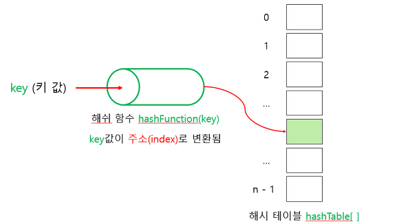
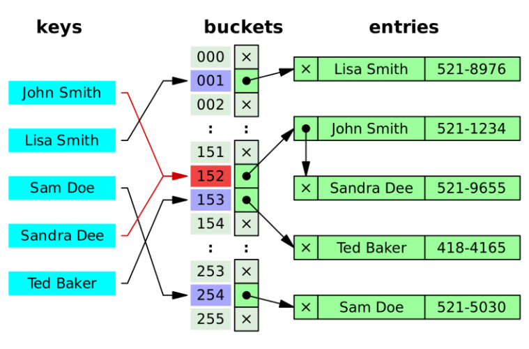
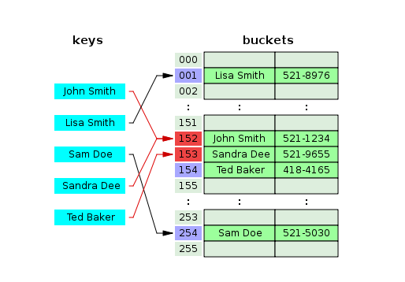

# DataStructure

## 해싱 (Hashing)
### 해싱이란 ?
* 키 값에 직접 산술적인 연산을 적용하여 항목이 저장되어 있는 테이블의 주소를 계산하여 항목에 접근하는 방식
* 자료를 저장할 때 배열을 사용하며 어떤 항목의 탐색 키만을 가지고 바로 항목이 저장되어 있는 배열의 인덱스를 결정하는 기법
* 키 값의 연산에 의해 직접 접근이 가능한 구조를 해시테이블(Hash Table)이라 부르고, 해시 테이블을 이용한 탐색을 해싱(Hashing)이라 한다.
* 해싱의 기본구조
   
* key 값을 가지고 해시함수에 접근하여 산술적인 연산을 거친 뒤 배열의 인덱스를 결정하는 hash값을 생성하여 value를 저장하는 방식
* 알고리즘 적으로 사용할 때는 중복된 값을 처리하는 알고리즘에서 해싱을 자주 사용

### 해싱의 문제점
* 해시 충돌(Hash Collision)이 발생한다
* key값을 해시함수를 통해 산술연산을 하여 hash값을 생성했지만 이전에 똑같은 hash값이 생성된 적이 있을 때 충돌이 발생
* n+1개의 비둘기(key값들)가 n개의 비둘기 집(hash값들)에 들어간다면 적어도 1개 이상의 비둘기 집에 2마리 이상의 비둘기가 있을 것이다 (비둘기 집의 원리)

### 해싱 충돌 (Hash Collision) 해결방법
* Seperate Chaining방식
   
   * 위의 사진을 보면 4번째의 Sandra Dee가 1번째의 John Smith와 해시함수를 통해 생선된 해시값이 동일함
   * Chaining방식은 기존의 hash값에 등록된 John의 뒤에 Linked List방식을 사용하여 Sandra를 연결시키는 방식이다.
   * 장점
      * 한정된 저장소를 효율적으로 사용 가능
      * 해시 함수를 선택하는 중요성이 상대적으로 적다.
      * 상대적으로 적은 메모리를 사용한다. (미리 공간을 잡을 필요가 없기 떄문)
   * 단점
      * 한 Hash에 자료들이 계속 연결된다면 검색효율을 낮출 수 있음
      * 외부 저장공간을 사용한다.
      * 외부 저장공간 작업을 추가로 해야한다.
   * 시간복잡도
      * 삽입, 삭제, 검색: O(n)
* Open Addressing방식
   
   * 위의 사진을 보면 4번째의 Sandra Dee가 1번째의 John Smith와 해시함수를 통해 생선된 해시값이 동일함
   * OpenAdressing방식은 기존의 hash값에 등록된 John이 존재할 때 그 다음 해시값에 Sandra를 저장하는 방식 (1개의 해시와 1개의 값이 매칭되어 있는 형태)
   * 5번째의 Ted같은 경우도 기존의 hash값에 Sandra가 등록되어 있기 때문에 그 다음 해시값에 Ted를 저장
   * 비어있는 해시를 찾는 과정은 항상 동일해야 한다.
   * 비어있는 해시 찾는 규칙
      * 선형탐색(Linear Probing): 다음 해시(+1)나 n개(+n)를 건너뛰어 비어있는 해시에 데이터를 저장
      * 제곱탐색(Quadratic Probing): 충돌이 일어난 해시의 제곱을 한 해시에 데이터를 저장
      * 이중해시(Double Hashing): 다른 해시함수를 한번 더 적용한 해시를 구해서 데이터를 저장
   * 장점
      * 또 다른 저장공간 없이 해시테이블 내에서 데이터 저장 및 처리가 가능
      * 또 다른 저장공간에서의 추가작업이 필요없다.
   * 단점
      * 해시함수의 성능에 전체 해시테이블의 성능이 결정된다.
      * 데이터의 길이가 늘어나면 그에 해당하는 저장소를 마련해야 된다 (1-1 방식이기 때문)
   * 시간복잡도
      * 삽입, 삭제, 검색: O(n)