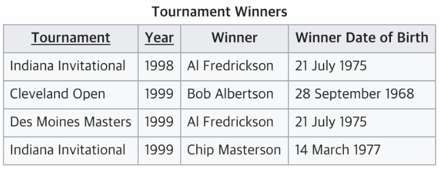

# Database

## 커넥션풀 (Connection pool)
### 커넥션풀이란 ?
* 구조
  
* 데이터베이스와 연결된 커넥션을 미리 만들어서 풀속에 저장해 두고 있다가 필요할 때 커넥션을 풀에서 쓰고 다시 풀에 반환하는 기법
* 웹 프로그램에서는 데이터베이스의 환경설정과 연결관리 등을 따로 xml파일이나 속성파일을 사용해서 관리
### 사용이유
* 사용자가 데이터베이스를 사용할 때마다 커넥션을 생성하여 연결해야 되는 비효율적인 문제를 해결하기 위해 사용
* 예를들어 웹사이트에 사용자가 게시판을 확인하고 게시물도 수정하고 새로운 게시물을 등록한다면 DB접속은 총 3번이 필요하다 (데이터 검색, 데이터 갱신, 데이터 삽입)
* 커넥션풀은 이렇게 3번의 커넥션을 생성하는 것 대신에 미리 생성된 커넥션을 빌려줌으로 써 기존에 풀에 생성된 커넥션을 제외하고는 커넥션 생성을 하지 않음
### 사용자가 풀안에 있는 커넥션보다 많다면 ?
* 현재 커넥션을 사용하고 있는 사용자가 커넥션을 풀에 반납할 때까지 기다리다가 들어온 사용자 순서대로 다시 커넥션을 빌려준다

## 데이터베이스 기본 개념
### 테이블 구성요소
* 릴레이션
  * 릴레이션은 말그대로 테이블을 의미
* 애트리뷰트 (속성)
  * 사람이라는 데이터로 가정할 때 이름, 나이 와 같은 구성요소
* 튜플 (레코드)
  * 한 명의 사람을 지칭, 특정 속성들을 이루고 있는 하나의 데이터
* 디그리 (차수)
  * 속성의 갯수
* 카디너리티
  * 튜플의 갯수
* 예제
  

## 키 (Key)
### 키란 ?
* 데이터베이스 테이블에서 튜플을 찾을 때 서로 구분할 수 있는 기준이 되는 속성값들
### 키의 종류
* 슈퍼키
  * 테이블에서 튜플을 찾을 때 구분할 수 있는 기준이 되는 모든 속성값들의 집합
  * 유일성을 만족하지만 최소성을 만족하지 못한다
  * 유일성: 모든 튜플을 구분할 수 있는 정도
  * 최소성: 구분할 수 있는 모든 속성값들이 최솟값을 이루는 정도
* 후보키
  * 슈퍼키에서 최소성을 만족하는 키들의 집합
  * 유일성과 최소성을 모두 만족
* 기본키
  * 후보키에서 선택된 주 키
* 대체키
  * 후보키에서 기본키로 선택되지 못한 나머지 키
* 외래키
  * 다른 테이블의 속성을 참조하고 있는 키

## 정규화 (Normalization)
### 정규화란 ?
* 관계형 데이터베이스의 설계에서 중복을 최소화 하기 위해 테이블을 분리 시켜 데이터를 구조화하는 기법
* 불필요한 데이터를 없앨 수 있고, 삽입/삭제/갱신 시 발생할 수 있는 이상현상(Anamolies)들을 방지할 수 있음
### 1차 정규화
* 1차 정규화의 조건: 테이블의 모든 속성값을 원자 값으로 분리 (모든 컬럼이 1개의 데이터만 소유해야 함)
* 정규화 전
  
* 정규화 후
  
* Telephone Number속성에 존재하는 2개 이상의 데이터 들을 1개의 값들로 모두 분리
### 2차 정규화
* 2차 정규화의 조건: 종속관계에서 부분 함수적 종속 제거, 완전 함수적 종속으로만 이루어진 테이블로 구성
* 완전 함수적 종속: 모든 기본키에 종속이 되는 관계
* 부분 함수적 종속: 기본키의 일부분에 의해 종속이 되는 관계
* 정규화 전
  
* 정규화 후
  
  
* 기본키가 Manufacturer과 Model인데 Manufacturer Country속성 같은 경우 Manufacturer만으로도 종속관계가 이루어짐
* 부분 함수적 종속관계이므로 테이블을 분리하여 모든 테이블을 완전 함수적 종속관계로 변형
### 3차 정규화
* 3차 정규화의 조건: 종속관계에서 이행적 함수적 종속 제거
* 이행적 함수적 종속: A->B, B->C 일때 A->C를 만족하는 관계
* 정규화 전
  
* 정규화 후
  
* (Tournament, Year) -> (Winner), (Winner) -> (Winner Date of Birth)일 때 (Tournament, Year) -> (Winner Date of Birth) 관계가 성립 함
* 3차 정규화에 위반 되므로 테이블을 분리
### BCNF
* BCNF의 조건: 종속관계에서 후보키가 아닌 결정자 제거
* 정규화 전
  
* 정규화 후
  
* 후보키는 (학번, 과목명), (학번, 담당교수)이지만 존재하는 함수적 종속은 (학번, 과목명) -> (담당교수), (학번, 담당교수) -> (과목명), (담당교수) -> (과목명) 이 존재
* (담당교수) -> (과목명)에서 담당교수는 후보키가 아니기 때문에 테이블을 분리
* 대부분 아무리 많은 정규화를 해도 BCNF까지 한다.
### 4차 정규화
* 4차 정규화의 조건: 다중값 종속 제거
### 5차 정규화
* 5차 정규화의 조건: 테이블의 모든 조인이 후보키를 통해서만 성립

## 트랜잭션 (Transaction)
### 트랜잭션이란 ?
* 데이터베이스의 상태를 변화시키는 하나의 논리적 기능을 수행하는 단위
* 데이터베이스 시스템에서 병행제어 및 회복 작업 시 처리되는 작업의 논리적 단위
* 사용자가 시스템에 서비스 요구 시 시스템이 응답하기 위한 상태 변환 과정의 작업 단위
* 하나의 트랜잭션은 항상 Commit되거나 Rollback 된다
  * Commit: SQL문이 실행되어 데이터베이스에 적용되는 기법
  * Rollback: SQL문이 실행되기 이전의 값으로 데이터베이스의 상태를 되돌려 놓는 기법
### 트랜잭션의 성질
* 원자성(Atomicity)
  * 트랜잭션의 연산은 데이터베이스에 모두 반영되거나 모두 반영되지 않아야 한다
  * 작은 오류 하나라도 발생한다면 수행되지 않고 모두 취소가 되어야 한다
* 일관성(Consistency)
  * 트랜잭션이 실행을 성공적으로 완료하면 항상 일관성 있는 데이터베이스 상태로 변환되어야 한다
  * 시스템이 가지고 있던 요소들은 트랜잭션 적용 전과 후가 같아야 한다
* 독립성(Isolation)
  * 하나의 트랜잭션이 실행중일 때는 다른 트랜잭션이 간섭할 수 없다
  * 수행중인 트랜잭션이 완전히 종료될 때까지 다른 트랜잭션은 수행결과를 참조할 수 없다
* 지속성(Durablity)
  * 트랜잭션이 실행을 성공적으로 완료하면 시스템이 고장나더라도 영구적으로 반영되어야 한다

## 뷰 (View)
### 뷰란 ?
* 뷰는 사용자에게 접근이 혀용된 자료만을 제한적으로 보여주기 위해 하나 이상의 기본 테이블로부터 유도된 이름을 가지는 가상 테이블
* 기본테이블로부터 유도된 테이블이기 때문에 기본 테이블과 같은 형태의 구조를 사용하며 조작도 기본테이블과 거의 동일
### 뷰의 장단점
* 장점
  * 논리적 데이터 독립성을 제공
  * 동일 데이터에 대해 동시에 여러 사용자의 상이한 응용이나 요구를 지원
  * 사용자의 데이터 관리를 간단하게 함
  * 접근 제어를 통한 자동 보안
* 단점
  * 독립적인 인덱스를 소유할 수 없음
  * 뷰의 정의를 변경할 수 없기 떄문에 alter문을 사용할 수 없음
  * 구성내용에 따라 삽입, 삭제, 갱신의 제약이 따름
### 사용방법
  * create view {뷰이름}({속성1}, {속성2}, ...) as select ({속성1}, {속성2}, ...) from {테이블이름} {where 조건절}

## 인덱스 (Index)
### 인덱스란 ?
* 테이블의 동작 속도를 높여주기 위한 기법
* 많은 null값을 갖거나 중복이 많거나 데이터가 많을 때 인덱스를 사용하면 효과적임
* 반면에 테이블의 크기가 작은 곳에 인덱스를 만드는 것은 불필요
### 사용방법
  * alter table {테이블이름} add index({속성})