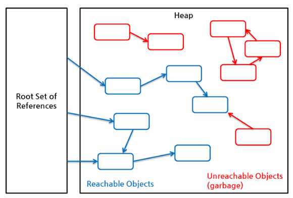
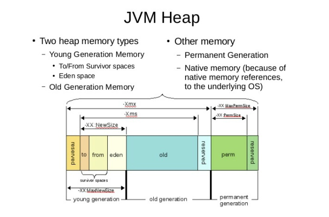

# Java

## 가비지컬렉션 (Garbage Collection)
### 가비지컬렉션이란 ?
 * JVM의 Heap영역에서 이루어지는 것으로 이미 할당된 메모리에서 더 이상 사용하지 않는 메모리를 해제하는 행동 (자동으로 실행)
 * 사용되지 않는 메모리의 대상은 Heap과 Method Area에서 사용되지 않는 Object를 의미한다.
 * 소스상의 close()와 같은 메서드는 Object의 사용중지 의사표현일 뿐 메모리에서 삭제하겠다는 의미가 아님
 * 개발자는 System.GC()를 통해 명시적으로 가비지컬렉션을 호출할 수 있지만 메서드 호출은 Full GC를 수행시키는 메서드이기 때문에 Suspend Time(stop-the-world) 시간이 길고 무거운 작업이며 또한 반드시 즉시 수행한다는 보장도 없기 때문에 지양하는 메서드이다.

### 룸셋과 가비지컬렉션
 * 가비지컬렉션은 말 그대로 가비지(더 이상 참조(사용)되지 않는 Object)를 모으는 작업
 * RoomSet에서 어떤 식으로든 참조 관계가 있다면 Reachable Object, 즉 현재 사용하고 있는 Object로 간주하며 그렇지 않은 경우는 Unreachable Object가 된다
 * Unreachable Object에는 참조되지만 더 이상 사용되지 않는 Object인 Memory Leak Object도 존재
   

### 가비지컬렉션이 수행될 때
 * 가비지컬렉션이 수행된 메모리의 해지는 할당된 그 자리에서 이루어지며 그로 인해 Heap 메모리 단편화 문제가 발생 (객체를 할당할 자리가 있지만 자리가 듬성듬성 되있고 연속적이지 않아 객체를 할당하지 못하는 현상)
 * JVM에서는 이러한 단편화 문제를 해소하기 위해 compaction같은 알고리즘을 사용
 * 하지만 compaction은 비용이 큰 작업이기에 TLAB(Thread Local Allocation Block)을 사용하여 단편화 문제를 해결

### JVM Heap구조
 
 * JVM Heap에서는 Young, Old, Perm 세 영역으로 나뉨
 * 이 중 Perm(Permanent) 영역은 거의 사용되지 않는 영역으로 클래스와 메서드 정보와 같이 자바 언어 레벨에서는 사용X
 * 고려하야 될 자바의 메모리 영역은 4개의 영역(Young-Eden, Young-to Survivor, Young-from Survivor, Old)으로 나뉨