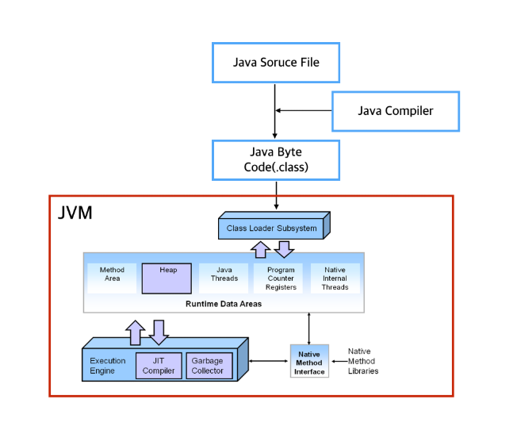

# Java

## JVM (Java Virtual Machine)
### JVM이란 ?
* JVM이란 Java Byte Code를 OS에 맞게 해석하여 운영체제에 독립적인 플랫폼을 갖게 해줌
   
* 프로그램의 메모리 관리를 스스로 하여 C프로그램 처렁 직접 메모리할당을 하지 않음

## 가비지컬렉션 (Garbage Collection)
### 가비지컬렉션이란 ?
* JVM의 Heap영역에서 이루어지는 것으로 이미 할당된 메모리에서 더 이상 사용하지 않는 메모리를 해제하는 행동 (자동으로 실행)
* 사용되지 않는 메모리의 대상은 Heap과 Method Area에서 사용되지 않는 Object를 의미한다.
* 소스상의 close()와 같은 메서드는 Object의 사용중지 의사표현일 뿐 메모리에서 삭제하겠다는 의미가 아님
* 개발자는 System.GC()를 통해 명시적으로 가비지컬렉션을 호출할 수 있지만 메서드 호출은 Full GC를 수행시키는 메서드이기 때문에 Suspend Time(stop-the-world) 시간이 길고 무거운 작업이며 또한 반드시 즉시 수행한다는 보장도 없기 때문에 지양하는 메서드이다.

### 룸셋과 가비지컬렉션
* 가비지컬렉션은 말 그대로 가비지(더 이상 참조(사용)되지 않는 Object)를 모으는 작업
* RoomSet에서 어떤 식으로든 참조 관계가 있다면 Reachable Object, 즉 현재 사용하고 있는 Object로 간주하며 그렇지 않은 경우는 Unreachable Object가 된다
* Unreachable Object에는 참조되지만 더 이상 사용되지 않는 Object인 Memory Leak Object도 존재
   

### 가비지컬렉션이 수행될 때
* 가비지컬렉션이 수행된 메모리의 해지는 할당된 그 자리에서 이루어지며 그로 인해 Heap 메모리 단편화 문제가 발생 (객체를 할당할 자리가 있지만 자리가 듬성듬성 되있고 연속적이지 않아 객체를 할당하지 못하는 현상)
* JVM에서는 이러한 단편화 문제를 해소하기 위해 compaction같은 알고리즘을 사용
* 하지만 compaction은 비용이 큰 작업이기에 TLAB(Thread Local Allocation Block)을 사용하여 단편화 문제를 해결

### JVM Heap구조
* 구조
   
* JVM Heap에서는 Young, Old, Perm 세 영역으로 나뉨
* 이 중 Perm(Permanent) 영역은 거의 사용되지 않는 영역으로 클래스와 메서드 정보와 같이 자바 언어 레벨에서는 사용X
* 고려하야 될 자바의 메모리 영역은 4개의 영역(Young-Eden, Young-to Survivor, Young-from Survivor, Old-메모리)으로 나뉨
* 메모리에 객체가 생성되면 Eden영역에 객체가 지정
* Eden영역에 데이터가 어느정도 쌓이면 영역에 있던 객체가 survivor 영역으로 옮겨지거나 삭제됨 (Survivor 영역에는 우선순위가 있지 않지만 두 개중 한 곳은 반드시 비어 있어야 됨)
* Survivor 영역 중 비어있는 곳에 Eden 영역에 있던 객체가 할당
* 할당된 Survivor 영역이 차면 GC가 되면서 Eden영역에 있는 객체와 꽉 찬 Survivor 영역에 있는 객체가 비어있는 Survivor영역으로 이동
* 더 큰 객체가 생성되거나 더 이상 Young 영역에 공간이 남지 않으면 객체들은 Old 영역으로 이동

### 가비지컬렉션의 종류
* 마이너 GC
   * Young 영역에서 발생하는 GC
* 메이저 GC
   * Old 영역이나 Perm 영역에서 발생하는 GC

### 가비지컬렉션 방식
* 시리얼 콜렉터(Serial Collector)
   * 구조
      
   * Young 영역과 Old 영역이 시리얼(연속적)하게 처리되며 하나의 CPU를 사용
   * 처리를 수행할 때 애플리케이션 수행이 정지됨(Stop-the-world)
   * 살아있는 객체들은 Eden영역에 존재
   * Eden영역이 꽉차면 to Survivor로 살아있는 객체가 이동(이동하기에 너무 큰 객체는 Old영역으로 이동), from Survivor영역에 살아있는 객체도 to Survivor영역으로 이동
   * to Survivor영역이 꽉 찼을 경우, Eden영역이나 from Survivor영역에 남아있는 객체들은 Old영역으로 이동
   * Old영역이나 Perm영역에서 Mark-Sweep-Compact 콜렉션 알고리즘을 통해 안쓰는거 표시해서 삭제하고 한 곳으로 모으는 역할을 수행
      * Mark: Old 영역으로 이동된 객체들 중 살아있는 객체를 식별
      * Sweep: Old 영역의 객체들을 훑는 작업을 수행하여 쓰레기 객체를 식별
      * Compact: 필요없는 객체들을 지우고 살아있는 객체들을 한 곳으로 모음
   * 대기시간이 많아도 크게 문제되지 않는 시스템에서 사용(클라이언트 종류의 장비)
   * 시리얼 콜렉터 명시적 지정 방법
      * -XX:+UseSerialGC
* 병렬 콜렉터(Parallel Collector)
   * 구조
      
   * 다른 CPU가 대기상태로 남아있는 것을 최소화 하는 것이 목표인 콜렉터
   * 시리얼 콜렉터와는 달리 Young영역에서 콜렉션을 병렬로 처리
   * 많은 CPU를 사용하기 때문에 GC의 부하를 줄이고 애플리케이션의 처리량을 증가시킬 수 있음
   * Old영역의 GC는 시리얼 콜렉터와 마찬가지로 Mark-Sweep-Compact 콜렉션 알고리즘을 사용
   * 병렬 콜렉터 명시적 지정 방법
      * -XX:+UseParallelGC
* 병렬 컴팩팅 콜렉터(Parallel Compacting Collector)
   * Young영역에서는 병렬 콜렉터와 동일하지만 Old영역 GC에서 새로운 알고리즘을 사용
   * 병렬 콜렉터와 동일하게 이 방식도 여러 CPU를 사용하는 서버에 적합
   * 병렬 컴팩팅 콜렉터 명시적 지정 방법
      * -XX:+UseParallelOldGC
* CMS 콜렉터(Concurrent Mark Sweep Collector)
   * 구조
      
   * 힙 메모리 영역의 크기가 클 때 적합
   * Young 영역에 대한 GC는 병렬 콜렉터와 동일하지만 Old 영역의 GC는 Mark, Sweep, Remark, Concurrent Sweep 단계를 거침
      * Mark: 매우 짧은 대기시간으로 살아있는 객체를 식별
      * Sweep: 서버수행과 동시에 살아있는 객체에 표시를 해놓음
      * Remark: Concurrent표시 단계에서 표시하는 동안 변경된 객체에 대해 다시 표시
      * Concurrent Sweep: 표시되어 있는 쓰레기를 정리
   * CMS 콜렉터 방식은 2개 이상의 프로세스를 사용하는 서버에 적합(웹서버)
   * CMS 콜렉터 명시적 지정 방법
      * -XX:+UseConcMarkSweepGC

## 객체지향 프로그래밍 (Object Oriented Programming)
### 객체지향 프로그래밍이란 ?
* 절차지향 프로그래밍과 같이 입력을 받아 명시된 순서대로 처리하는 것이 아니라 프로그램을 수많은 '객체'라는 기본 단위로 나누어 객체들간 상호작용을 하는 프로그래밍
### 객체란 ?
* 말 그대로 대상을 나타내는 단어
* 하나의 역할을 수행하는 메서드와 변수의 묶음
* ex) 붕어빵
### 객체지향 프로그래밍의 특징
* OOP is a pie (Object Oriented Programming is Abstract Polynomial Inherit Encapsulate)
* 추상화(Abstract)
   * 목적과 관련이 없는 부분을 제거하여 필요한 부분만을 표현하기 위한 개념
   * ex) 붕어빵을 만들려고 한다고 가정한다면 붕어빵 재료인 밀가루반죽과 팥만 필요하다고 명확하게 명시
* 다형성(Polynomial)
   * 형태가 같은데 서로 다른기능을 하는 개념
   * ex) 똑같은 붕어빵 기계인데 하나는 팥붕어빵을 만드는 기계이고 다른 하나는 슈크림붕어빵을 만드는 기계
   * 이름을 명시적으로 나누지 않고 똑같은 이름으로 다른 기능을 제공하기 위해 사용
   * 다형성의 대표적인 것이 오바리이딩(Overriding)
* 상속성(Inherit)
   * 말 그대로 부모가 사용하는 기능들을 상속 받는 개념
   * 똑같은 코드를 중복하는 것을 방지하기 위해 사용
* 캡슐화(Encapsulate)
   * 사용되는 기능들을 하나의 캡슐에 담아서 사용한다는 개념
   * ex) 붕어빵 안에 팥, 슈크림, 밀가루반죽 등이 같이 들어 있는 것을 의미
   * 캡슐화의 가장 주된 역할은 정보은닉
      * 정보은닉: 겉으로 표현할 것만 표현해주고 그렇지 않은 것들은 정보를 숨기는 방법
      * ex) 붕어빵의 겉은 붕어빵 모형을 이룬 밀가루지만 속안에는 어떤 재료가 들어가 있는지를 알 수 없음
### 객체지향 프로그래밍의 장단점
* 장점
   * 코드의 재활용
      * 프로그램이 독립된 객체들로 이루어져 있기 때문에 재활용이 용이
   * 디버깅이 쉽다
   * 코딩이 간편함
* 단점
   * 속도가 느리다
      * 컴파일러에서 처리해야 될 양이 많고 여러가지 정보에 대한 오버헤드가 있기 때문
   * 설계에 많은 시간이 소비
### 클래스란 ?
* 추상화를 한 매개체
* 변수와 메서드의 조합으로 만들어짐
* ex) 붕어빵 틀