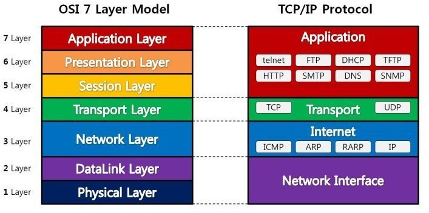

# Network

## OSI 7 계층 (Open System Interconnection 7 Layer)
### OSI 7 계층이란 ?
* 네트워크에서 통신이 일어나는 과정을 7단계로 나눈 것을 의미
* 통신이 일어나는 과정을 단계별로 파악할 수 있기 때문에 계층을 나눔
### 계층 단계
  * 구조
    
  * 1계층
    * 물리 계층(Physical Layer)
  * 2계층
    * 데이터링크 계층(DataLink Layer)
  * 3계층
    * 네트워크 계층(Network Layer)
  * 4계층
    * 전송 계층(Transport Layer)
  * 5계층
    * 세션 계층(Session Layer)
  * 6계층
    * 표현 계층(Presentation Layer)
  * 7계층
    * 응용 계층(Application Layer)
