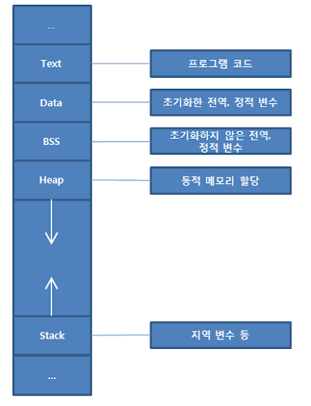
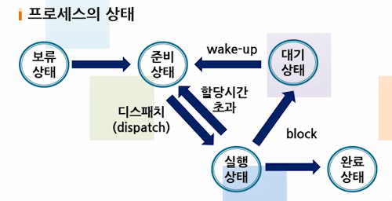

# OS

## 프로세스 (Process)
### 프로세스란 ?
* 일반적으로 CPU에 의해 처리되는 사용자 프로그램, 즉 실행중인 프로그램을 의미하며 작업 또는 Task라고도 한다.

* 여러 형태로의 정의
  * 실행중인 프로그램
  * 비동기적 행위
  * 실행중인 프로시저
  * PCB를 가진 프로그램
    * PCB(Process Control Block): 특정 프로세스를 제어할 때 필요한 상태 정보를 포함하는 운영체제 커널의 자료구조 / 프로세스가 생성되면 메모리에 PCB를 생성하고 프로세스가 실행을 종료하면 PCB도 삭제된다.
  * 실기억장치에 저장된 프로그램

* 프로세스 구조
  

* 프로세스 상태변화
  

## 스레드 (Thread)
### 스레드란 ?
* 프로세스 내에서 실행되는 흐름의 단위 / 일반적으로 하나의 프로그램은 하나의 스레드를 가지고 있지만 프로그램 환경에 따라 둘 이상의 스레드를 동시에 실행할 수 있음 (멀티스레딩이라고 부름)

### 스레드의 특징
* 스택을 스레드마다 독립으로 할당: 독립적인 실행 흐름을 추가하기 위해
* PC Register를 스레드마다 독립적으로 할당: PC(Program Counter)값은 스레드가 명령어의 주소를 기억하는 역할을 담당 / CPU를 할당받았다가 스케줄러에 의해 선점당하기 때문에 연속적으로 수행되지 못해 어느 부분까지 수행했는지 기억할 필요가 있음

### 멀티스레딩의 장점
* 응답성: 다른 스레드가 작업을 수행하더라도 프로그램 수행이 계속되어 사용자에 대한 응답성 증가
* 자원공유: 같은 주소공간 내에 여러 개의 다른 활동성 스레드를 가질 수 있음
* 경제성: 프로세스를 생성하는 것보다 스레드를 생성하고 문맥교환을 하는 편이 보다 경제적
* 멀티프로세서 활용: 단일 스레드는 CPU가 많아도 CPU 한개에서만 실행되지만 멀티스레딩은 멀티프로세서 구조에서 병렬로 수행 가능

### 멀티스레딩의 단점
* 데이터와 힙영역을 공유하기 때문에 다른 스레드에서 사용중인 변수나 자료구조에 접근하여 엉뚱한 값을 읽거나 수정할 수 있음
* 병목현상으로 인해 단일 스레드의 실행시간보다 오히려 지연될 수 있음

## 스케줄링 (Scheduling)
### 스케줄링이란 ?
* 다중 프로그래밍을 가능하게 하는 운영체제의 동작 기법 중 하나이다.
* 프로세스들에게 CPU 등의 자원 배정을 적절히 하여 시스템의 성능을 개선한다.

### 비선점 스케줄링
* 이미 할당된 CPU를 다른 프로세스가 강제로 빼앗을 수 없는 스케줄링 기법
  * FCFS: 프로세스가 도착한 순서대로 CPU를 할당하는 기법
  * SJF: 실행시간이 가장 짧은 프로세스에게 먼저 CPU를 할당하는 기법
  * HRN: 우선순위를 계산하여 가장 높은 것부터 CPU를 할당하는 기법
    * 우선순위 = (대기시간 + 실행시간) / 실행시간

### 선점 스케줄링
* 하나의 프로세스가 CPU를 할당받아 실행하고 있을 때 다른 프로세스가 CPU를 강제로 빼앗아 사용할 수 있는 스케줄링 기법
  * SRT: 새로 도착한 프로세스의 실행시간을 비교하여 가장 짧은 프로세스에게 CPU를 할당하는 기법
  * Round-Robin: 시분할 시스템으로 고안된 방식 / 시간할당량만 실행한 후 다음 프로세스에게 CPU를 넘겨주고 준비상태의 맨 뒤로 배치
  ```
  time-slice: 4초
  시간      4   8   12   16   20   24   28   30   34   37   38
  P1(15)    4            8              12             15(end)
  P2(10)        4              8             10(end)
  P3(13)            4               8             12        13(end)
  ```
  * 다단계 큐 스케줄링
  * 다단계 피드백 큐 스케줄링

## 프로세스 동기화 (Process Synchronization)
### 프로세스 동기화란 ?
* 공유된 자원들을 프로세스가 사용할 때 발생되는 문제를 제어하기 위해 하나의 자원은 하나의 프로세스만 사용할 수 있도록 하는 것

### 임계 영역(Critical Section)
* 프로세스가 자원을 할당받았을 때 작업을 실행하는 곳
* 임계 영역의 문제 해결을 위한 기본 조건
  * 상호배제(Mutual Exclusion)
    * 어떤 프로세스가 임계 영역에서 자원을 할당 받아 실행중일 때 다른 프로세스는 해당 임계 영역에 진입할 수 없음
  * 진행(Progress)
    * 임계 영역에서 실행중인 프로세스가 없다면 임계 영역으로 진입하려는 프로세스들 중 하나는 유한한 시간 내에 진입이 가능
  * 한정된 대기(Bounded Waiting)
    * 한 프로세스가 임계 영역에 진입을 요청한 후에는 다른 프로세스의 임계 영역 진입을 유한한 횟수로 제한 (무한히 기다리지 않음)

### 동기화 기법
* 뮤텍스(Mutex)
  * 스레드의 동기화 기법으로 공유된 자원에 여러 스레드가 동시에 접근하는 것을 막음
* 세마포어(Semaphore)
  * 프로세스의 동기화 기법으로 공유된 자원에 여러 프로세스가 동시에 접근하는 것을 막음
* 뮤텍스 VS 세마포어
  * 뮤텍스는 공유자원 1개로 한정되어 있고 세마포어는 공유자원을 여러 개로 조절을 할 수 있음
  * 대표적인 예로 음식점 화장실이 있음
  * 뮤텍스는 음식점에 화장실이 1개여서 누군가가 키를 가지고 화장실을 사용하고 있으면 키를 가지고 나올 때 까지 기다려야 됨
  * 세마포어는 음식점에 화장실이 3개(여러 개)여서 한 명씩 화장실을 사용할 때마다 키가 하나씩 없어짐, 화장실을 모두 사용하고 있다면 대기하고 있다가 먼저 키를 가지고 나오는 화장실을 사용함
  * 세마포어는 뮤텍스가 될 수 있지만 뮤텍스는 세마포어가 될 수 없음
  * 뮤텍스 같은 경우는 뮤텍스를 소유하고 있는 쓰레드만 뮤텍스가 해제가 가능, 세마포어는 세마포어를 소유하고 있지 않는 쓰레드도 세마포어 해제 가능

### 데드락(DeadLock) = 교착상태
* 한정된 자원을 여러 곳에서 사용하려고 할 때 발생하는 문제
* 데드락이 발생하는 경우
  
  * A 프로세스가 a라는 자원을 사용하다가 b라는 자원을 사용하는 상황이 발생
  * b 라는 자원은 B 프로세스가 이미 사용하고 있기에 A 프로세스는 자원을 사용할 수 있을 때까지 대기
  * B 프로세스도 a라는 자원을 사용하려고 하지만 A 프로세스가 자원을 아직 소유하고 있기 때문에 B 프로세스도 자원을 사용할 수 있을 때까지 대기
  * 결과적으로 모두 실행 상태로 변경 되지 못하며 교착 상태가 만들어짐
* 데드락의 발생 조건
  * 상호배제(Mutual Exclusion): 자원은 한 번에 하나의 프로세스만 사용할 수 있음
  * 점유대기(Hold and Wait): 최소한 하나의 자원을 점유하고 있으면서 다른 자원을 추가로 점유하기 위해 대기하는 프로세스가 있어야 한다.
  * 비선점(No Preemption): 다른 프로세스에 할당된 자원은 사용이 끝날 때까지 강제로 빼앗을 수 없음
  * 순환대기(Circular Wait): 각 프로세스는 순환적으로 다음 프로세스가 요구하는 자원을 소유하고 있음, {P0, P1, ..., Pn}이라는 프로세스 집합이 있을 때 P0은 P1이 점유한 자원을 대기하고 P1은 P2가 점유한 자원을 대기하는 방식 (Pn-1은 Pn이 점유한 자원을 대기, Pn같은 경우는 P0가 점유한 자원을 요구)
* 데드락 해결방법
  * 예방: 데드락 발생 조건(상호배제, 점유대기, 비선점, 순환대기) 중 하나를 제거함으로 써 해결, 자원의 낭비가 심함
  * 회피: 데드락이 일어나는 경우를 피해가는 방법 (은행원 알고리즘이 대표적(Banker's Algorithm))
  * 탐지: 자원할당 그래프를 통해 데드락을 탐지
  * 회복: 데드락을 일으킨 프로세스를 종료하거나 할당된 자원을 해제함으로써 회복
    * 프로세스 종료방법: 데드락 된 프로세스를 모두 중지 -> 데드락이 제거될 때까지 프로세스를 하나씩 중지