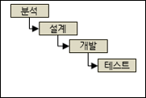
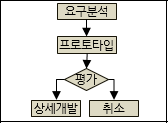
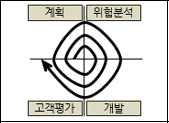
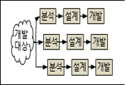
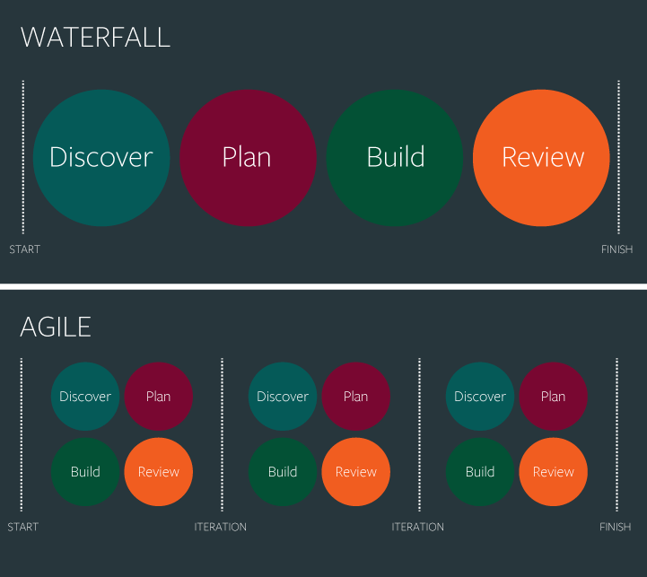

# Sofeware Engineering

## 소프트웨어 생명주기 모델
### 소프트웨어 생명주기 모델이란 ?
* 소프트웨어를 기획부터 개발, 폐기까지 하나의 주기를 보고 이를 효과적으로 관리하기 위한 절차
### 구성
* 요구명세화 -> 분석 -> 설계 -> 개발 -> 시험 -> 유지보수
### 종류
* 폭포수 모델
  * 개념도
    
  * 특징: 단계적, 순차적 접근
  * 장점: 이해가 용이하고 관리가 편함
  * 단점: 요구분석이 어려움
* 프로토타이핑 모델
  * 개념도
    
  * 특징: 프로토타입을 개발
  * 장점: 요구분석이 용이, 개발타당성 검증 가능
  * 단점: 프로토타입 폐기에 대한 비용 증가
* 나선형 모델
  * 개념도
    
  * 특징: 위험분석, 반복적인 개발
  * 장점: 위험성 감소와 변경에 유여한 대처
  * 단점: 단계반복에 따른 공정관리의 어려움
* 반복적 모델
  * 개념도
    
  * 특징: 증분을 병행 개발
  * 장점: 병행개발로 인한 일정 단축 가능
  * 단점: 병행개발에 따른 관리비용 증가

## 애자일 개발 방법론
### 애자일 개발 방법론이란 ?
* 소프트웨어 개발방법에 있어서 아무런 계획이 없는 개발방법과 계획이 지나치게 많은 개발 방법들 사이에서 타협점을 찾고자 하는 방법론

### 특징
* 계획을 통해서 주도해 나갔던 방법론들과는 달리 앞을 예측하며 개발을 하지 않고, 일정주기를 가지고 끊임없이 프로토타입을 만들어내며 그때 그때 필요한 요구를 더하고 수정하여 하나의 커다란 소프트웨어를 개발해 나감

### 애자일 개발 방법론의 장단점
* 장점
  * 프로젝트 진행 중간 중간에 필요한 요소들을 변경할 수 있음
  * 시작할 때 프로젝트를 정확하게 규정하지 않아도 됨
  * 작은 요소들을 출시 할 때 빠르게 만들기가 가능
  * 점진적으로 테스트되기 때문에 초기에 버그 발견이 가능
* 단점
  * 시간이 오래 걸림

### 폭포수 VS 애자일
  * 개념도 차이
    
  * 애자일이 각광받는 이유
    * 가벼운 개발 방법을 통해 고객과의 협력을 강조하고, 과정과 도구 보다는 개인과 상호작용을 더 중요시하며, 계획을 따르는 것보다 변화에 대처하기 때문