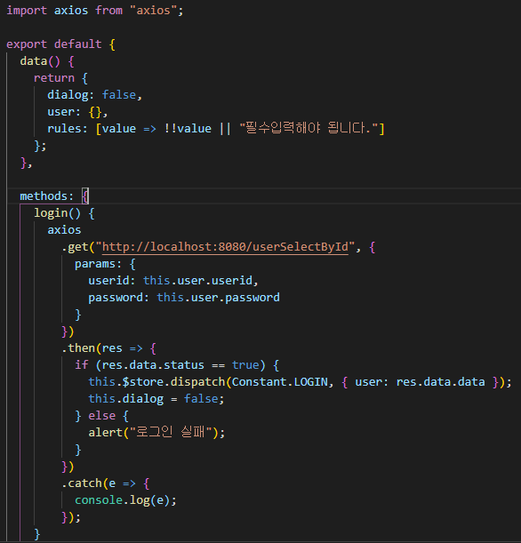

## 기본설정
 * VS Code를 실행시키고 왼쪽바의 맨 아래 Extension에서 다음 파일들 설치
    * Live Server
    * Vue 2 Snippets
    * Beautify
    * Auto Rename Tag
    * Vue Peek
    * Vetur
    * Bracket Pair Colorizer
 * 크롬 웹스토어에에서 확장 프로그램 추가
    * Vue.js devtools
 * Node.js 설치
    * https://nodejs.org/ko/로 접속 or 검색창에 Node.js 검색
 * yarn 설치
    * VS Code 상단바에 있는 Terminal을 눌러 New Terminal or 키보드로 ctrl + shift + ` 입력
    * terminal에서 npm install -g yarn 입력
 * power shell 보안설정
    * window 검색창에 power shell을 검색하여 관리자 권한으로 실행
    * Set-ExecutionPolicy RemoteSigned 입력
 * vue cli 설치
    * yarn global add @vue/cli or npm install -g @vue/cli
 * vue project 생성
    * vue create 뷰 프로젝트 이름 -> ex) vue create first
    * default 선택
    * 프로젝트를 생성하고 package.json을 들어가면 script에서 실행가능한 명령들 확인 가능, serve 뒤에 "--open --port 포트"를 입력하면 해당 포트로 바로 실행 가능 -> ex) --open --port 9090
 * yarn serve로 vue 실행

 ## axios 사용하기
  * terminal에 npm install --save axios 입력
  * yarn을 설치하였을 경우 yarn add axios 입력도 가능
  아래는 보류
  * main.js의 상단에 import axios from 'axios', new Vue 안에 axios 입력
    

## vue router 사용하기
 * terminal에 npm install --save vue-router 입력
 * yarn을 설치하였을 경우 yarn add vue-router 입력도 가능
 * main.js의 상단에 import VueRouter from 'vue-router', 비어있는 곳에 Vue.use(VueRouter) 입력
    
 * 사진과 같이 assets에 router.js를 만들고 router로 사용할 컴포넌트들을 등록
    
 * main.js의 상단에 router.js의 위치를 찾아 import해주고, new Vue 안에 router 입력
    
 * router를 사용하고 싶은 곳에 <router-view></router-view>로 router위치 등록, 등록된 위치에 router를 가져오는 방법은 this.$router.push를 사용
    

## vuetify 사용하기
 * terminal에 npm install vuetify 입력
 * yarn을 설치하였을 경우 yarn add vuetify 입력도 가능
 * terminal에 vue add vuetify 입력
    * default 선택
    * 주의해야 될점: App.vue가 싹 갈리니 미리 작성한 내용들이 있다면 백업을 해야 됨
    * 실행이 완료되면 App.vue부터 시작해서 여러가지 파일들이 자동생성

## vuex 사용하기
 * terminal에 npm install vuex 입력
 * yarn을 설치하였을 경우 yarn add vuex 입력도 가능
 * 사진과 같이 assets에 vuex.js를 만들고 state, mutation, action을 등록
    
 * Constant는 상수값을 저장하기 위한 용도, 다음과 같이 asset에 Constant.js를 만들고 등록
    
 * main.js의 상단에 vuex위치를 찾아 store로 저장하고 new Vue 안에 vuex 입력
    
 * vuex의 state 값에 데이터 저장 방법 (dispatch 사용)
    
 * vuex의 state 값에 있는 데이터 불러오는 방법
    